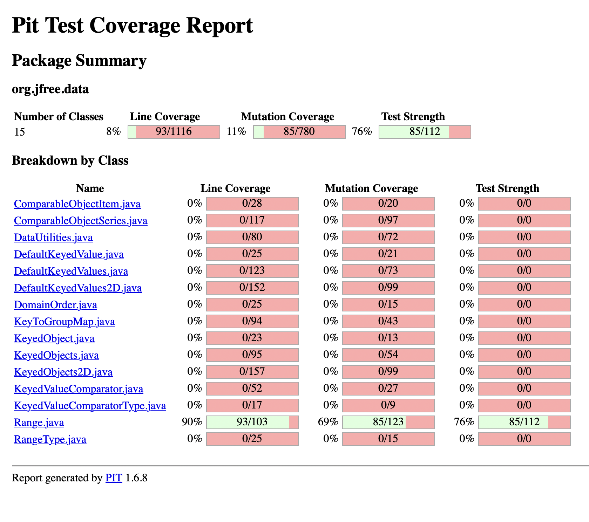
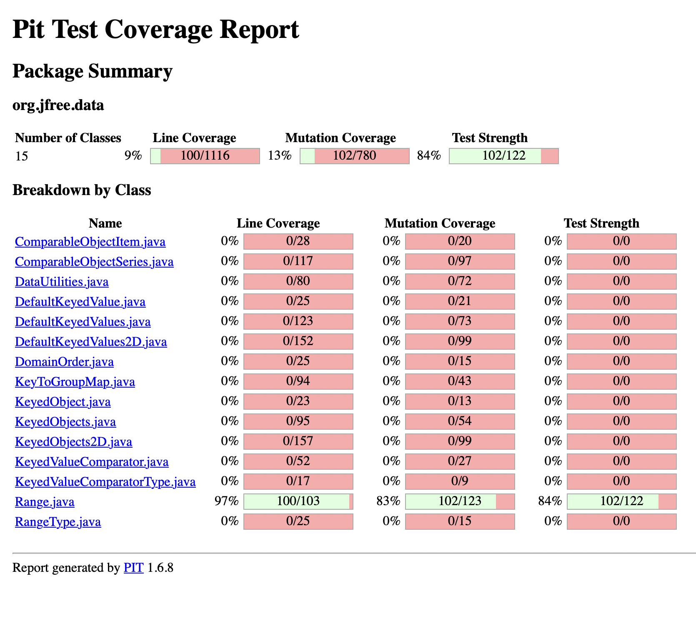
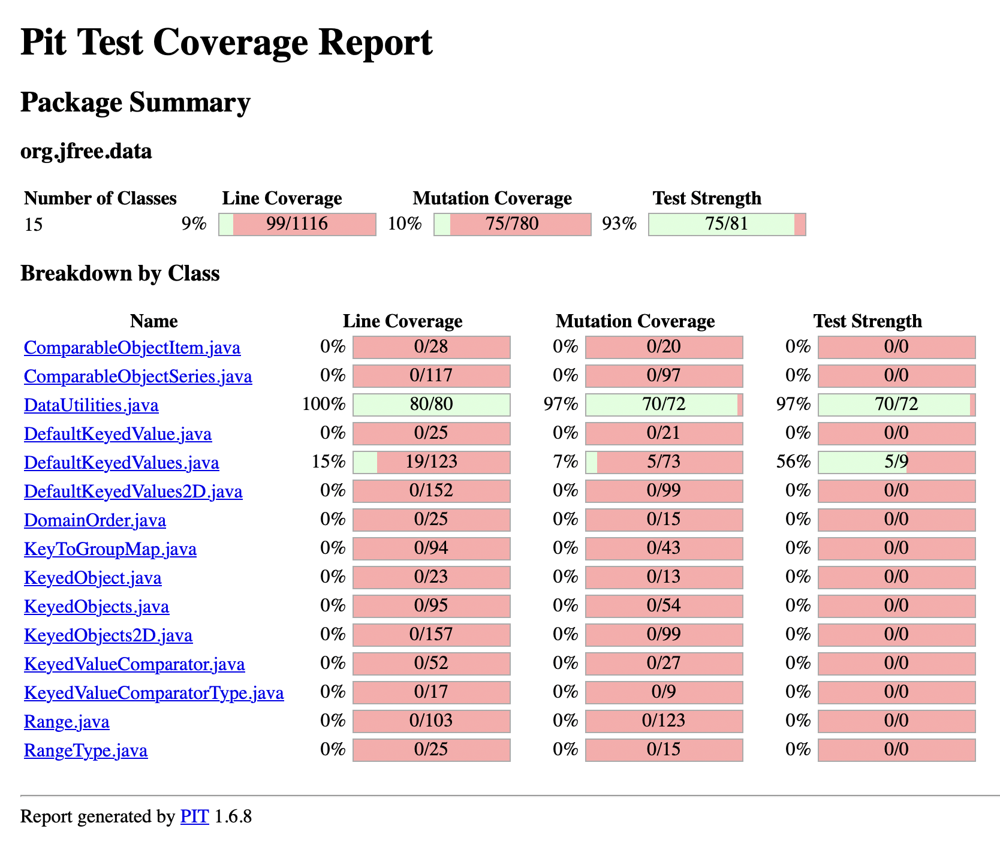
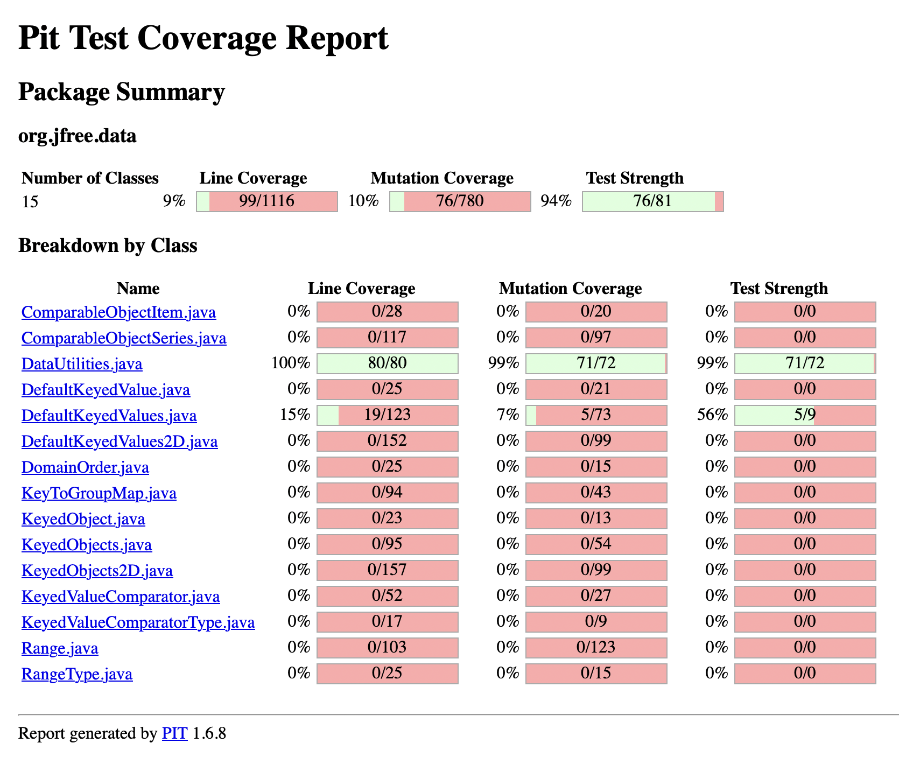

**SENG 637 - Dependability and Reliability of Software Systems**

**Lab. Report \#4 – Mutation Testing and Web app testing**

| Group \#:      |  17   |
| -------------- | --- |
| Student Names: | Mustayeen Abedin    |
|                |  Nur-Alhuda Ali   |
|                |  Brandon Lac   |
|                |  Mevin Moncy   |

# Introduction

# Analysis of 10 Mutants of the Range class 

## contains()
```
public boolean contains(double value) {
        return (value >= this.lower && value <= this.upper);
}
```
Mutants:

1. Negated Conditional (KILLED) - This mutant would have been killed by the test case `containsValueSlightlyAboveRange()` because it checks if a value slightly above the range is not contained within the range, expecting the result to be false. The negated conditional mutant would return the opposite result (true instead of false), causing the test case to fail.
2. Replaced boolean return with false (KILLED) - This mutant would have been killed by the test case `containsValueWithinRange()` because it replaces the boolean return value with false, making the method always return false regardless of the input value. Since this test case expects the result to be true for a value within the range, the mutant would fail this test case.
3. Replaced boolean return with true (KILLED) - This mutant would have been killed by the test case `containsValueSlightlyAboveRange()` as well. It replaces the boolean return value with true, so it would always return true regardless of the input value. Since this test case expects the result to be false, the mutant would fail this test case.

## combine(Range range1, Range range2)
```
public static Range combine(Range range1, Range range2) {
        if (range1 == null) {
            return range2;
        }
        if (range2 == null) {
            return range1;
        }
        double l = Math.min(range1.getLowerBound(), range2.getLowerBound());
        double u = Math.max(range1.getUpperBound(), range2.getUpperBound());
        return new Range(l, u);
}
```
Mutants:

4. Negated Conditional `range1 == null` (KILLED) - This mutant would have been killed by the test case `combineNullRangeAndNonNullRange()`. The mutant changes the conditional check range1 == null to range1 != null, which would cause the method to return range1 instead of range2 when range1 is not null. However, the test case expects the method to return null when range1 is null, so the mutant fails this test case.
5. Replaced return value, `return range2`, with null (KILLED) - This mutant would have been killed by the same test case `combineNullRangeAndNonNullRange()`. The mutant changes the return value from range2 to null when range1 is null. Since the test case expects the method to return range2 when range1 is null, the mutant fails this test case.
6. Negated Conditional `range2 == null` (KILLED) - This mutant would have been killed by the test case `combineRange2NullRanges()`. The mutant changes the conditional check range2 == null to range2 != null, which would cause the method to return range2 instead of range1 when range2 is not null. However, the test case expects the method to return null when range2 is null, so the mutant fails this test case.
7. Replaced return value, `return new Range(l, u)`, with null (KILLED) - This mutant would have been killed by the test case `combineTwoNullRanges()`. The mutant changes the return value from new Range(l, u) to null, which would cause the method to return null when both range1 and range2 are null. Since the test case expects the method to return null in this scenario, the mutant fails this test case.

## expand(Range range, double lowerMargin, double upperMargin)
```
public static Range expand(Range range,
                               double lowerMargin, double upperMargin) {
        ParamChecks.nullNotPermitted(range, "range");
        double length = range.getLength();
        double lower = range.getLowerBound() - length * lowerMargin;
        double upper = range.getUpperBound() + length * upperMargin;
        if (lower > upper) {
            lower = lower / 2.0 + upper / 2.0;
            upper = lower;
        }
        return new Range(lower, upper);
}
```
Mutants:

8. Replaced double multiplication with division, `double lower = range.getLowerBound() - length * lowerMargin` (KILLED) - This mutant would have been killed by the test case `expandWithPositiveMargins()`. The mutant changes the calculation of `lower` from `range.getLowerBound() - length * lowerMargin` to `range.getLowerBound() - length / lowerMargin`. Since the test case expects the method to correctly calculate the lower bound with multiplication, the mutant fails this test case.
9. Replaced double addition with subtraction, `double upper = range.getUpperBound() + length * upperMargin` (KILLED) - This mutant would have also been killed by the test case `expandWithPositiveMargins()`. The mutant changes the calculation of `upper` from `range.getUpperBound() + length * upperMargin` to `range.getUpperBound() - length * upperMargin`. Since the test case expects the method to correctly calculate the upper bound with addition, the mutant fails this test case.
10. Negated conditional, `lower > upper` (KILLED) - This mutant would have been killed by the test case `expandWithNegativeMargins()`. The mutant changes the conditional check `lower > upper` to `lower <= upper`, which would cause the method to return incorrect results when the lower bound is not greater than the upper bound. Since the test case expects the method to correctly handle this scenario with the original conditional check, the mutant fails this test case.


# Report all the statistics and the mutation score for each test class

Our Range test class from Lab 3 initially had 69% mutation coverage. 



After adding test cases, we increased the Range test suite's mutation coverage to 83%.



Our DataUtilities test class from Lab 3 performed very well without alterations, with a 97% mutation coverage. 



After adding only one test case, we increased the DataUtilities test suite mutation coverage to 99%.



# Analysis drawn on the effectiveness of each of the test classes

For both the Range and DataUtilities test classes, we reviewed the test cases against the code to identify areas where mutations were not covered by existing tests. Utilizing mutation analysis, we were able to identify surviving mutants and designed test cases specifically targeting those mutants to enhance the overall mutation score.

## Range Test Class

Using the original Range test class from lab 3, we got a mutation score of 69%. Most of the mutants that survived were either negated conditionals or a change of the conditional boundary. By adding tests that target these conditions, we were able to improve the mutation score of the Range test class to 83%. These are the design methodologies we used to design the additional test cases:

1. **Boundary Value Analysis (BVA):** We created test cases to cover boundary conditions, ensuring that methods behave correctly when input values are at the lower and upper bounds of the range (`getLengthNormalRangeReturnsLength`, `getCentralValueNormalRangeReturnsCentralValue`, `intersectsBoundsWithinRangeReturnsTrue`).

2. **Equivalence Partitioning:** We designed test cases to cover different equivalence classes or partitions of input values. For example, we created test cases like `expandToIncludeValueBelowLowerBoundReturnsNewRangeWithExpandedLowerBound` and `expandToIncludeValueAboveUpperBoundReturnsNewRangeWithExpandedUpperBound` to represent different partitions based on input values being within or outside the current range.

3. **Negative Testing:** We included test cases to check the behavior of methods under invalid or unexpected input conditions. For instance, test cases such as `intersectsLowerBoundBelowRangeReturnsFalse` and `intersectsUpperBoundAboveRangeReturnsFalse` verify the behavior when the input bounds do not intersect with the range.

4. **Special Cases Handling:** We added test cases to handle special cases such as NaN (Not a Number) inputs, as seen in test cases like `isNaNRangeWithNaNRange`, `isNaNRangeUpperNaNBoundOnly`, and `isNaNRangeLowerNaNBoundOnly`. This ensures that the methods handle exceptional scenarios appropriately. 

By incorporating these methodologies, we ensured that the test suite became more comprehensive, covering a wider range of scenarios and achieving better code coverage. This ultimately led to a significant improvement in the mutation score from 69% to 83%.

## DataUtilities Test Class

From the initial mutation testing done on our DataUtilities test class from lab 3, we achieved a very high mutation score of 97%. The mutant that survived the testing removed the null check from the method, `calculateRowTotal(Values2D data, int row, int[] validCols)`. Since we didn't have a test to cover this scenario, we added one. This increased our mutation score for the DataUtilities test class to 99%. Since our original mutation score for this class was already very high, we were only able to improve it by 2%.


# A discussion on the effect of equivalent mutants on mutation score accuracy

In the Range test class, we had many equivalent mutants that changed the conditional boundary of conditions in various methods. The Pitest conditionals boundary mutator replaces the relational operators with their boundary counterpart (eg. < would become <= ). So, change the relational operator to the boundary counterparts in most cases  did not change the outcome of our tests. Here is an example in the `intersects(double b0, double b1)` method:

```
public boolean intersects(double b0, double b1) {
        if (b0 <= this.lower) {
            return (b1 > this.lower);
        }
        else {
            return (b0 < this.upper && b1 >= b0);
        }
}
```

The conditional `b0 <= this.lower` was changed to `b0 < this.lower`. This resulted in the same outcome as in the non-mutated SUT because the `b0` used in the tests was always lower than `this.lower` and never equal to it, so removing the equal sign did not change anything.

We found this equivalent mutant and others like it by looking at the list of mutants that survived, identifying the method in which they were injected, and evaluating each of our tests for that method on the mutated method. If running all our tests on the mutated code did not change the outcome of any of the tests, then it is an equivalent mutant.

In general, we found our Range Test class to have many equivalent mutants that made it tricky and time-consuming to improve our mutation score for the class.

# A discussion of what could have been done to improve the mutation score of the test suites

Conducting a more detailed boundary value analysis would mitigate many of the equivalent mutants that we found in the Range test class and would have likely improved the mutation score. Repeating some the tests that had equivalent mutants with input values exactly at the boundary would solve the issue of equivalent mutants that change the conditional boundary of conditions since it tests the 'equals' part of a relational operator.


# Why do we need mutation testing? Advantages and disadvantages of mutation testing

In lab 2, we explored black-box testing, with the primary goal of checking whether the JFreeChart software meets specific requirements and behaves correctly based on specified inputs and outputs. In lab 3, we implemented white-box testing, which involves examining the internal logic, structure, and paths within the code to ensure thorough coverage and identify potential errors or vulnerabilities. Mutation testing takes it a step further by deliberately introducing small changes into the code that simulate potential faults or bugs. This assesses the quality of the tests produced from black-box and white-box testing by evaluating how well they can identify and respond to these mutations, allowing us to improve our test suites to a satisfactory level.

**Advantages of Mutation Testing:**

1. Mutation testing allows us to evaluate the effectiveness of our test suite by creating mutated versions of the code and checking if intentional faults are detected.
2. It helps improve the quality of test cases by forcing us to cover various scenarios, edge cases, and corner cases, leading to more robust testing and bug detection.
3. Mutation testing aids in fault localization by pinpointing areas in the code that need additional testing or improvement, enhancing debugging efficiency.
4. It serves as a form of code review by identifying potential coding errors, logic flaws, or ambiguities in the codebase that require attention.

**Disadvantages of Mutation Testing:**

1. Mutation testing can be resource-intensive due to the time and computational resources required for creating and executing mutations, making it impractical for some projects with tight deadlines or limited resources.
2. There's a risk of overfitting test cases to mutations, potentially creating a false sense of security if tests only perform well on mutated code but fail to detect actual bugs in the production environment.

# Explain your SELENUIM test case design process

The website we tested was Shop Smart Canada: [https://shopsmartcanada.com](https://shopsmartcanada.com). To design the test cases, we first thought of functionality that users would commonly use when visiting the website. For each test case, we jotted down a step by step process of how the test would go before recording the test so as to determine in advance what commands we would need (mouseOver, assert, verify, wait) to replicate human usage of the website. Once we knew how to properly get Selenium IDE to do what we want, we recorded the test cases.

The functionalities we tested were:
1. Login
2. Add Items to Cart
3. Subscribe to Newsletter
4. Sign Up for an Account
5. Search for Items
6. Browse Items from Menu
7. Browse Items from Homepage
8. Change Display Type of Items on Product Page

# Explain the use of assertions and checkpoints

Assertions, also known as checkpoints, were used in our test cases to verify that the tests were behaving as expected. In many of the test cases, we used assertions to verify the existence of of certain text on a page or a certain page title. For example, we used an assertions for the page titles to ensure the user is redirected to the correct page after clicking a button, like in the case of login with valid credentials or subscribing to newsletter with valid email. We used assertions for text on the results page after a search for an item was conducted to ensure the correct search-related items were retrieved and displayed. Another assertion we used was to verify the value of the 'quantity' of items added to the cart.

# how did you test each functionaity with different test data

The test data we used for each functionality tested was as follows:
1. Login
	i. valid login credentials - checked that account verification page was visited after login button clicked
	ii. invalid login credentials - checked that error message appeared after login button clicked
2. Add Items to Cart
	i. added 1 item to cart - checked that correct number of item was added to cart
	ii. added 5 items to cart - checked that correct number of item was added to cart
3. Subscribe to Newsletter
	i. subscribed using valid email format - checked that user redirected to successful subscription page after subscribe button clicked
	ii. subscribed using invalid email format - checked that user was not redirected to a different page after subscribe button clicked
4. Sign Up for an Account
	i. new, valid email - checked that user redirected to account page after register button clicked
	ii. email already registered - checked that error message appeared after register button clicked
5. Search for Items
	i. empty query - checked that user was not redirected to a different page after search button clicked
	ii. valid item, bicycle - checked that correct, search-related items appeared after search button clicked
6. Browse Items from Menu
	i. baby bedding - checked that user redirected to correct product page when category is selected from menu
	ii. telescope - checked that user redirected to correct product page when category is selected from menu
7. Browse Items from Homepage
	i. mattresses - checked that user redirected to correct product page when category is selected from homepage
	ii. rugs - checked that user redirected to correct product page when category is selected from homepage
8. Change Display Type of Items on Product Page
	i. one column - checked that items are displayed in one column on product page when 1-column display type is clicked
	ii. five columns - checked that items are displayed in five columns on product page when 5-column display type is clicked

# How the team work/effort was divided and managed

## Mutation Testing

We split the mutation testing equally amongst the group, 2 members per class as follows:

1. Range Class - Nur-Alhuda & Brandon
2. DataUtilities - Mustayeen & Mevin

## GUI Testing

We brainstormed all the functionalities we wanted to test as a group, and then split them amongst each other, each member taking 2 functionalities and coming up with 2 different input data per test. The work was divided as follows:

1. Login - Nur-Alhuda
2. Add Items to Cart - Nur-Alhuda
3. Subscribe to Newsletter - Brandon
4. Sign Up for an Account - Brandon
5. Search for Items - Mustayeen
6. Browse Items from Menu - Mustayeen
7. Browse Items from Homepage - Mevin
8. Change Display Type of Items on Product Page - Mevin

# Difficulties encountered, challenges overcome, and lessons learned

A major lesson we learned was how to identify equivalent mutants after conducting mutation testing and how crucial mutation testing is for enhancing the quality of a test suite. A difficulty we encountered was familiarizing ourselves with Selenium IDE and understanding how to make tests that function the way we want them to - we found it had a learning curve since we had not used anything like it before.

# Comments/feedback on the assignment itself

This lab gave us a solid foundation in mutation testing and a good introduction to GUI testing.


